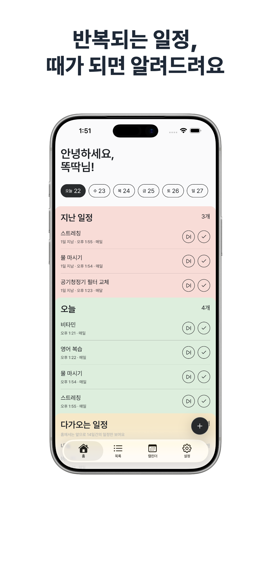
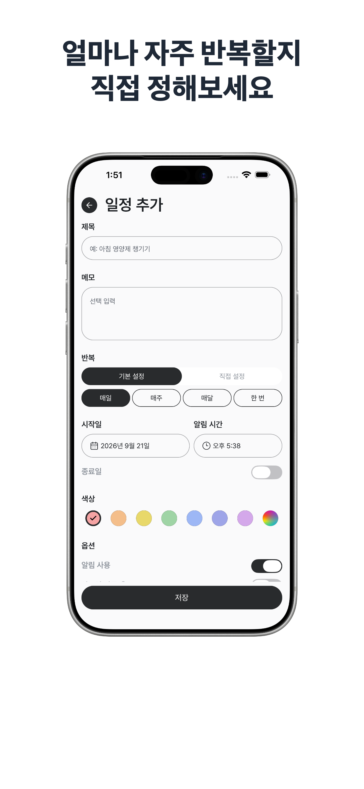
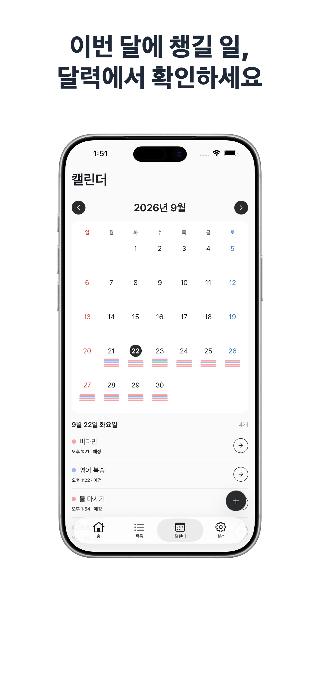

# 똑딱 - ttokttak

반복되는 생활 일정을 관리하는 iOS·Android 개인 리마인더 앱입니다.

비타민 복용, 필터 교체처럼 주기적으로 챙겨야 하는 일을 일정으로 등록하고 알림을 받습니다. 완료하거나 건너뛴 기록을 남기고 다음 예정일과 최근 처리 기록을 확인할 수 있습니다.

| 홈                               | 일정 생성                                          | 캘린더                                   |
| -------------------------------- | -------------------------------------------------- | ---------------------------------------- |
|  |  |  |

## 주요 기능

| 기능             | 내용                                                                                  |
| ---------------- | ------------------------------------------------------------------------------------- |
| 일정 등록        | 한 번, 매일, 매주, 매달 또는 n일·n주·n달 간격. 알림 시간, 종료일과 색상 설정          |
| 반복 기준 선택   | 정해진 날짜를 따르는 고정형 또는 실제 완료일을 기준으로 다음 일정 계산                |
| 일정 확인과 기록 | 홈에서 지난 일정·오늘·다가오는 일정을 확인하고 완료·건너뛰기 처리. 목록과 캘린더 제공 |
| 알림과 위젯      | 기기 로컬 알림, 처리 필요 수를 표시하는 앱 아이콘 뱃지, 읽기 전용 iOS 홈 화면 위젯    |
| 계정과 설정      | Apple·Google 로그인과 기기 간 동기화, 계정 삭제, 한국어·English, 라이트·다크 테마     |

완료일 기준 계산은 매일, n일마다, 매달과 n달마다 반복에서 지원합니다. 일정 공유·협업, 결제·구독·광고와 원격 푸시는 제공하지 않습니다.

## 주요 설계

- **반복 규칙과 처리 기록:** 개별 예정 시점인 occurrence를 DB에 미리 만들지 않습니다. 규칙 변경은 새 버전으로 추가해 과거 기록을 보존합니다. 자세한 계산은 [도메인 규칙](docs/DOMAIN_LOGIC.md)을 따릅니다.
- **내용 암호화와 복구:** 제목과 설명을 사용자별 키로 AES-GCM 암호화하고 로그인한 새 기기에서 서버 보조 방식으로 키를 복구합니다. 서버 실행 환경을 신뢰하므로 **종단간 암호화(E2EE)는 아닙니다.** 자세한 경계는 [ADR 0003](docs/adr/0003-server-assisted-content-key-recovery.md)에 기록합니다.
- **로컬 알림과 iOS 위젯:** 일정 내용이 원격 푸시 경로로 전달되지 않도록 현재 기기에 알림을 예약합니다. OS 상태에 따라 알림이 지연되거나 표시되지 않을 수 있으며, 위젯용 복호화 제목은 로컬 공유 저장소에 남습니다. [ADR 0002](docs/adr/0002-device-local-notifications.md)와 [ADR 0006](docs/adr/0006-expo-ios-home-widget.md)에서 제한을 설명합니다.

## 기술 스택

| 영역             | 기술                                        |
| ---------------- | ------------------------------------------- |
| 앱               | React Native, Expo, Expo Router, TypeScript |
| 서버             | Supabase Auth, PostgreSQL, Edge Functions   |
| 데이터와 폼      | TanStack Query, React Hook Form, Zod        |
| 테스트           | Jest, Deno Test                             |
| 배포와 오류 수집 | EAS, Sentry                                 |

## 개발

```sh
pnpm install
pnpm start
```

<details>
<summary>주요 명령</summary>

```sh
pnpm ios
pnpm android
pnpm test
pnpm lint
pnpm exec tsc --noEmit
```

`pnpm test`는 Jest와 Supabase Edge Function의 Deno 테스트를 실행하므로 Deno가 필요합니다.

</details>

<details>
<summary>환경 변수</summary>

앱 실행에 필요한 public env:

- `EXPO_PUBLIC_SUPABASE_URL`
- `EXPO_PUBLIC_SUPABASE_PUBLISHABLE_KEY`
- `EXPO_PUBLIC_GOOGLE_AUTH_WEB_CLIENT_ID`
- `EXPO_PUBLIC_GOOGLE_AUTH_IOS_CLIENT_ID`
- `EXPO_PUBLIC_SENTRY_DSN`

iOS native build에는 `GOOGLE_AUTH_IOS_URL_SCHEME`도 필요합니다.

Supabase Edge Function 공통 secret:

- `SUPABASE_URL`
- `SUPABASE_SERVICE_ROLE_KEY`
- `SB_PUBLISHABLE_KEY` 또는 `SUPABASE_ANON_KEY`
- `TTOKTTAK_CONTENT_KEY_WRAP_SECRET_BASE64`

Apple 계정 삭제 secret:

- `APPLE_TEAM_ID`
- `APPLE_KEY_ID`
- `APPLE_CLIENT_ID`
- `APPLE_PRIVATE_KEY`

서버 secret과 release credential은 앱의 `EXPO_PUBLIC_*` 값으로 넣지 않습니다.

</details>

## 문서

제품과 설계:

- [용어](CONTEXT.md)
- [제품 범위](docs/PRODUCT_SPEC.md)
- [도메인 규칙](docs/DOMAIN_LOGIC.md)
- [시스템 설계](docs/SYSTEM_DESIGN.md)
- [설계 결정](docs/adr/)
- [운영 스키마 snapshot](docs/database/DATABASE.sql)

운영:

- [릴리스](docs/release/RELEASE.md)
- [스토어 원문](docs/release/STORE_METADATA.md)
- [의존성 보안 점검](docs/security/DEPENDENCY_AUDIT.md)

에이전트 작업 규칙은 [AGENTS.md](AGENTS.md)를 따릅니다.

## 공개 범위

이 저장소는 소스 열람 목적으로 공개합니다.
별도 라이선스를 부여하지 않으며 외부 Issue와 PR을 받지 않습니다.

번들된 Pretendard는 [SIL Open Font License 1.1](assets/fonts/pretendard/LICENSE)을 따릅니다.
